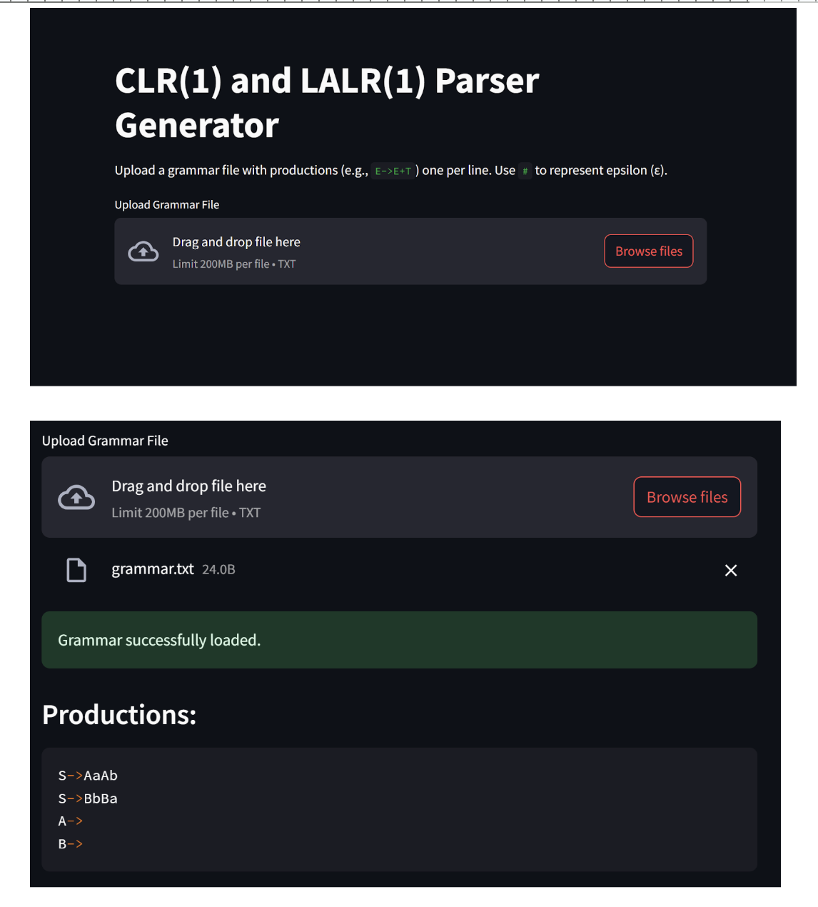
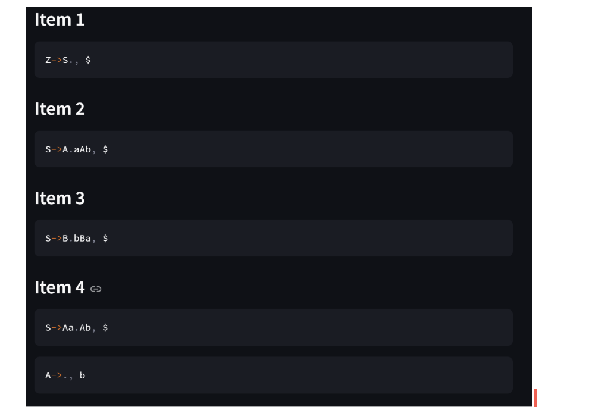
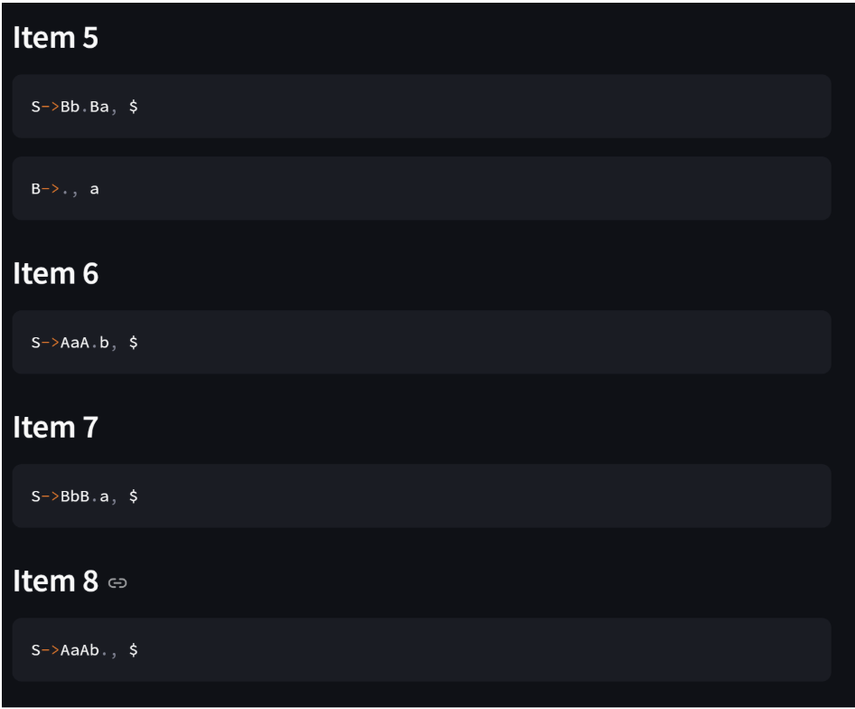
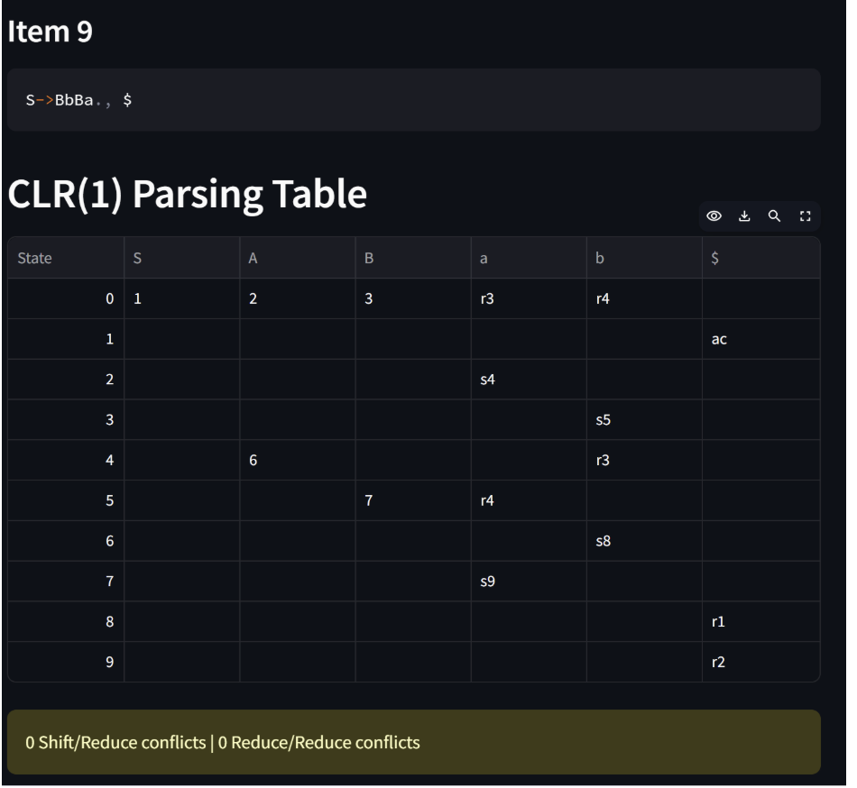

# 🧠 CLR_PARSER – Canonical LR(1) Parser in Python

This project implements a **Canonical LR (CLR)** parser in Python, designed to simulate the syntax analysis phase of a compiler using bottom-up parsing techniques. It constructs FIRST and FOLLOW sets, LR(1) item sets, and builds ACTION and GOTO parsing tables to validate input strings against a context-free grammar (CFG).

---

## 📌 Features

- Accepts user-defined context-free grammars
- Computes **FIRST** and **FOLLOW** sets
- Generates **LR(1) items**, **Closure**, and **GOTO**
- Builds **ACTION** and **GOTO** parsing tables
- Parses input strings using a simulated parsing stack
- Streamlit frontend for interactive grammar parsing

---

## 🛠️ Tech Stack

- **Language**: Python 3.x
- **Libraries**:
  - `re` – regular expressions
  - `tabulate` – formatted tables
  - `collections` – structured data handling
- **UI**: [Streamlit](https://streamlit.io) for frontend

---

## 📂 Folder Structure

```

CLR\_PARSER/
│
├── app.py                      # Streamlit frontend
├── app2.py                     # Additional interface logic
├── firstfollow\.py              # FIRST and FOLLOW computation
├── fixed\_refactored\_CLR.py     # CLR parsing logic (Closure, GOTO, Table gen)
├── Images/                     # Visual output of parsing steps
├── Report CLR PARSER.pdf       # Full report
└── **pycache**/                # Compiled Python cache (ignored)

````

---

## 🚀 How to Run

1. Clone the repository:
```bash
   git clone https://github.com/Bindhu-T-Devidas/CLR_PARSER.git
   cd CLR_PARSER
````

2. (Optional) Create a virtual environment:

   ```bash
   python3 -m venv venv
   source venv/bin/activate  # or venv\Scripts\activate on Windows
   ```

3. Install dependencies:

   ```bash
   pip install -r requirements.txt
   ```

4. Run the Streamlit app:

   ```bash
   streamlit run app.py
   ```

---

## 📘 Report

A detailed report of the project including implementation, methodology, and results is available in [`Report CLR PARSER.pdf`](./Report%20CLR%20PARSER.pdf).

---

## ✅ Future Enhancements

* Grammar validation with error feedback
* Parse tree visualization
* Detailed syntax error reporting
* Export parsing tables to CSV/PDF
* Support for advanced grammars (left-recursion, precedence handling)

---

##  Demo

### 📤 Upload a Grammar File


---

### 🔍 FIRST and FOLLOW Sets


---

### 📦 LR(1) Item Sets


---

### 📄 More LR(1) Items


---

### 🧮 CLR(1) Parsing Table


---

## 📄 License

MIT License – feel free to use, modify, and share!

---


